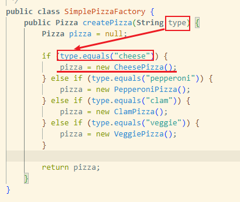
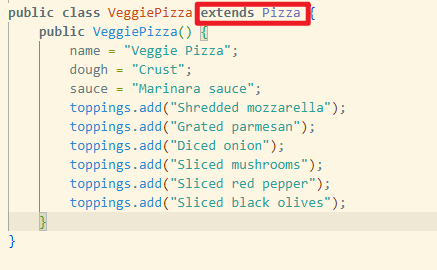
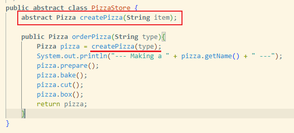
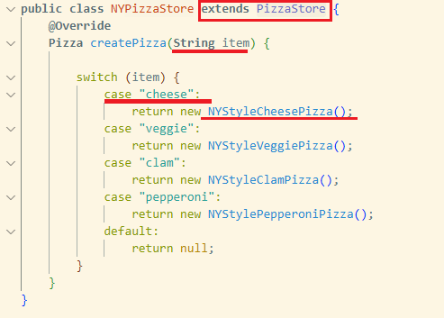
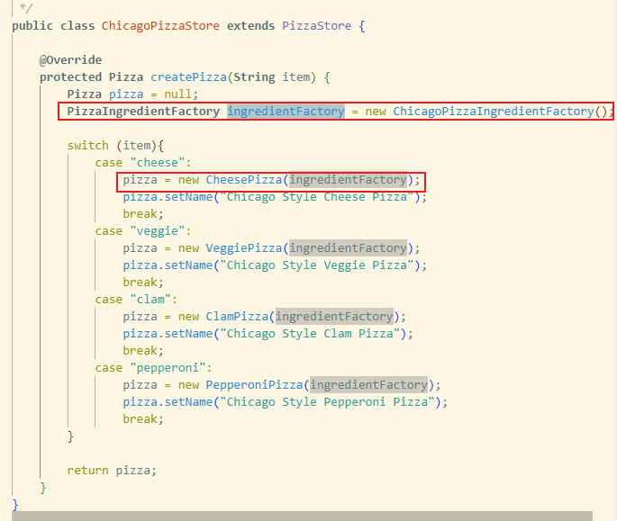
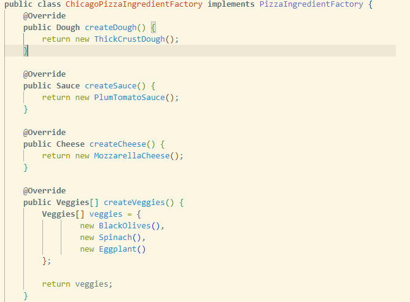
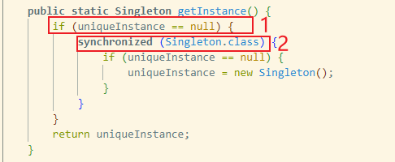

# 工厂 Factory

### 简单工厂 Simple Factory
> pizzas
- PizzaStore 构造参数接收一个披萨工厂
- PizzaStory 的 orderPizza 方法调用工厂方法 createPizza

    

- 工厂方法 createPizz 负责根据 pizza 类型创建具体的 Pizza 类

    

- 所有的具体披萨都继承 Pizza 超类

    

### 工厂方法 Factory Method
> pizzafm
- PizzaStore 的 orderPizza 方法调用 *抽象方法*  createPizza
    
- 具体的抽象工厂继承自超类 PizzaStore, 实现 createPizza 方法
    
- 所有的具体披萨也都继承 Pizza 超类

### 抽象工厂 Abstract Factory
> pizzaaf
- 具体的继承自 PizzaStore 的抽象工厂, 内部新增配料的抽象工厂

    
    

# 生成器 Builder
> hfdp中没有介绍


# 原型 Prototype
> hfdp没原型的代码
- 用于对象的复制
- 伪代码
```java
// 基础原型。
abstract class Shape is
    field X: int
    field Y: int
    field color: string

    // 常规构造函数。
    constructor Shape() is
        // ……

    // 原型构造函数。使用已有对象的数值来初始化一个新对象。
    constructor Shape(source: Shape) is
        this()
        this.X = source.X
        this.Y = source.Y
        this.color = source.color

    // clone（克隆）操作会返回一个形状子类。
    abstract method clone():Shape


// 具体原型。克隆方法会创建一个新对象并将其传递给构造函数。直到构造函数运
// 行完成前，它都拥有指向新克隆对象的引用。因此，任何人都无法访问未完全生
// 成的克隆对象。这可以保持克隆结果的一致。
class Rectangle extends Shape is
    field width: int
    field height: int

    constructor Rectangle(source: Rectangle) is
        // 需要调用父构造函数来复制父类中定义的私有成员变量。
        super(source)
        this.width = source.width
        this.height = source.height

    method clone():Shape is
        return new Rectangle(this)
```
1. 创建原型接口, 其中有 clone 方法
2. 原型类必须定义一个以本类对象为参数的构造函数, 构造函数必须复制参数对象中的所有成员变量值到新建的实体中
3. clone 方法的实现一般只有一行代码, 使用 new 调用原型版本的构造(第二步) 


# 单例 Singleton
> 直接看 dcl(double check lock)
- volatile 关键字, 在cpp中是禁止编译器做优化, java中我理解是避免读取缓存
- 多线程环境下, 先跳过读取到非null的线程, 然后对读取到null的线程做同步

    
