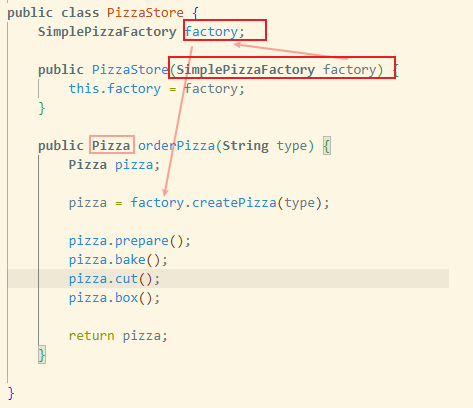

# 工厂 Factory

### 简单工厂 Simple Factory
> pizzas
- PizzaStore 构造参数接收一个披萨工厂
- PizzaStory 的 orderPizza 方法调用工厂方法 createPizza

    

- 工厂方法 createPizz 负责根据 pizza 类型创建具体的 Pizza 类

    

- 所有的具体披萨都继承 Pizza 超类

    

### 工厂方法 Factory Method
> pizzafm
- PizzaStore 的 orderPizza 方法调用 *抽象方法*  createPizza
    
- 具体的抽象工厂继承自超类 PizzaStore, 实现 createPizza 方法
    
- 所有的具体披萨也都继承 Pizza 超类

### 抽象工厂 Abstract Factory
> pizzaaf
- 具体的继承自 PizzaStore 的抽象工厂, 内部新增配料的抽象工厂

    
    

# 生成器 Builder
> hfdp中没有介绍

# 原型 Prototype
> hfdp没原型的代码
- 用于对象的复制

# 单例 Singleton
> 直接看 dcl(double check lock)
- volatile 关键字, 在cpp中是禁止编译器做优化, java中我理解是避免读取缓存
- 多线程环境下, 先跳过读取到非null的线程, 然后对读取到null的线程做同步

    
